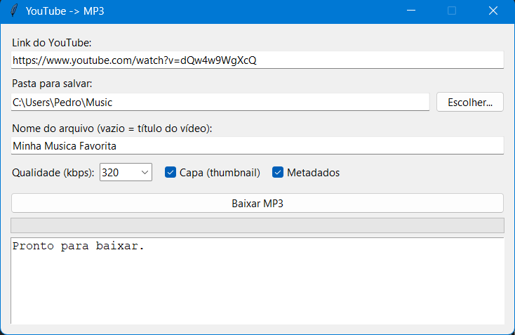
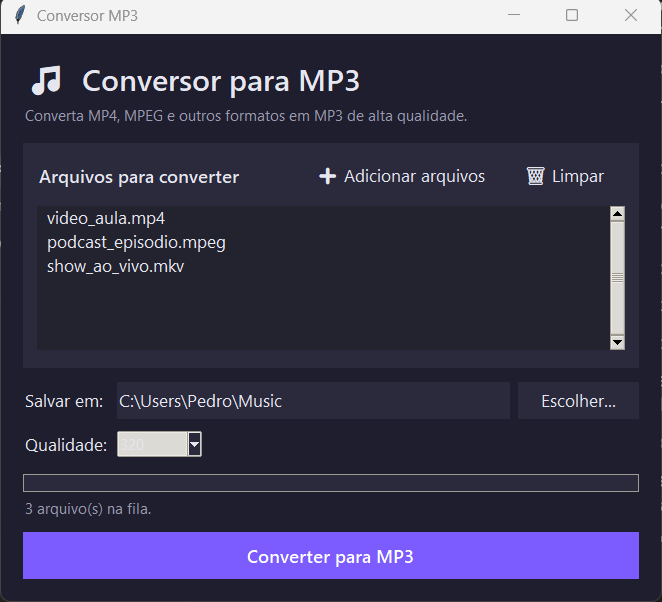

# 🎵 TuneForge

**Baixe do YouTube e converta seus arquivos em MP3 — fácil, rápido e sem corromper o áudio.**

Dois pequenos programas em Python com interface gráfica:

1. **Baixador do YouTube → MP3** — cole um link, escolha a pasta e o nome, e baixe o áudio em MP3 de alta qualidade, sem corromper o arquivo.
2. **Conversor MP3** — converte arquivos locais de vídeo/áudio (MP4, MPEG, AVI, MKV, MOV, WEBM e outros) em MP3.

O **ffmpeg vem embutido** via `imageio-ffmpeg` — não é necessário instalar ffmpeg manualmente.

---

## 📸 Telas

### Baixador do YouTube → MP3


### Conversor de arquivos → MP3


---

## ✨ Funcionalidades

### Baixador do YouTube (`baixar_mp3.py`)
- Campo para o **link** do YouTube
- Botão para **escolher a pasta** de destino
- Campo para definir o **nome do arquivo** (vazio = título do vídeo)
- **Qualidade** selecionável: 128 / 192 / 256 / **320 kbps**
- **Capa (thumbnail)** e **metadados** embutidos no MP3
- Barra de progresso e log em tempo real
- Refaz partes que falharem no download (evita áudio cortado/corrompido)

### Conversor MP3 (`conversor_mp3.py`)
- Interface escura moderna
- Converte **vários arquivos de uma vez**
- Aceita MP4, MPEG, MPG, AVI, MKV, MOV, WEBM, FLV, M4A, WAV, AAC, OGG, WMA, 3GP, TS
- Barra de progresso real (calculada pela duração do arquivo)
- Salva na mesma pasta dos originais ou em pasta escolhida
- Qualidade até **320 kbps**

---

## 📦 Instalação

Requer **Python 3.9+**.

```bash
pip install -r requirements.txt
```

Ou instale manualmente:

```bash
pip install yt-dlp imageio-ffmpeg
```

---

## ▶️ Como usar

### No Windows (mais fácil)
Dê **duplo-clique** em:
- `Abrir.bat` — abre o baixador do YouTube
- `Conversor.bat` — abre o conversor de arquivos locais

### Pelo terminal
```bash
python baixar_mp3.py      # baixador do YouTube
python conversor_mp3.py   # conversor de arquivos locais
```

---

## 🗂️ Estrutura

| Arquivo | Descrição |
|---|---|
| `baixar_mp3.py` | Baixador do YouTube → MP3 (interface gráfica) |
| `conversor_mp3.py` | Conversor de arquivos locais → MP3 |
| `requirements.txt` | Dependências do projeto |
| `Abrir.bat` | Atalho para o baixador (Windows) |
| `Conversor.bat` | Atalho para o conversor (Windows) |

---

## ⚠️ Aviso

Use estas ferramentas apenas para conteúdo que você tem o direito de baixar/converter (material próprio, de domínio público ou com licença que permita). Respeite os termos de uso do YouTube e a legislação de direitos autorais.

---

## 📄 Licença

Distribuído sob a licença **MIT**. Veja o arquivo [LICENSE](LICENSE) para mais detalhes.
